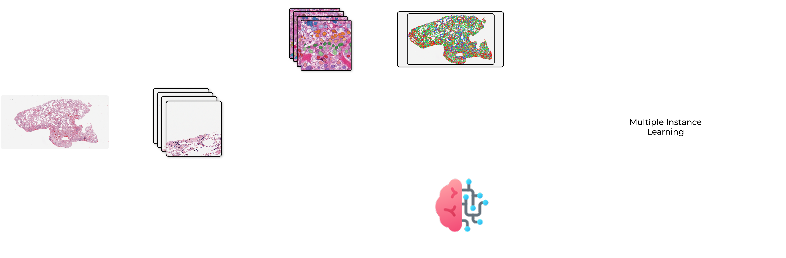

# CellMIL


[](https://camilosinningun.github.io/CellMIL/)

A flexible and modular framework for cell-level feature extraction and interaction modeling in a Multiple Instance Learning pipeline for digital pathology.



## Table of Contents

- [CellMIL](#cellmil)
  - [Table of Contents](#table-of-contents)
  - [Installation](#installation)
    - [Quick Install (Package Users)](#quick-install-package-users)
      - [1. Install PyTorch](#1-install-pytorch)
      - [3. 🚧 Install CellMIL 🚧](#3--install-cellmil-)
      - [4. Install Additional Dependencies](#4-install-additional-dependencies)
    - [Development Setup](#development-setup)
      - [1. Clone the Repository](#1-clone-the-repository)
      - [2. Create Conda Environment](#2-create-conda-environment)
      - [3. Install Python Dependencies](#3-install-python-dependencies)
      - [5. Install Additional Dependencies](#5-install-additional-dependencies)
      - [Windows DataLoader Workers](#windows-dataloader-workers)
      - [PyTorch Geometric Libraries](#pytorch-geometric-libraries)
      - [Pyradiomics Installation](#pyradiomics-installation)
  - [CLI Tools](#cli-tools)
    - [Data Preparation](#data-preparation)
    - [Cell segmentation](#cell-segmentation)
    - [Create graph](#create-graph)
    - [Feature extraction](#feature-extraction)
      - [Morphological](#morphological)
      - [Topological](#topological)
      - [Patch embeddings](#patch-embeddings)
    - [Feature visualization](#feature-visualization)
    - [Create dataset](#create-dataset)
  - [Technical Details](#technical-details)
    - [Supported Input Formats](#supported-input-formats)
    - [Metadata Excel Format](#metadata-excel-format)
    - [Output Directory Structure](#output-directory-structure)
    - [Resource Requirements](#resource-requirements)
  - [Development](#development)
    - [Project Structure](#project-structure)
    - [Running Tests](#running-tests)
    - [Building Documentation](#building-documentation)
  - [References](#references)
    - [Multiple Instance Learning Models](#multiple-instance-learning-models)
    - [Cell Segmentation Models](#cell-segmentation-models)
    - [Tools and Frameworks](#tools-and-frameworks)
    - [Others](#others)
  - [Contributions](#contributions)

## Installation

### Quick Install (Package Users)

For users who want to use CellMIL as a package without modifying the source code.

#### 1. Install PyTorch

First, install PyTorch based on your system's CUDA version. Visit [pytorch.org](https://pytorch.org/get-started/locally/) to get the correct command.

Example for CUDA 12.1:
```bash
pip install torch torchvision --index-url https://download.pytorch.org/whl/cu121
```

Example for CPU-only:
```bash
pip install torch torchvision --index-url https://download.pytorch.org/whl/cpu
```

<!-- #### 2. Install PyTorch Geometric

Visit [PyG installation guide](https://pytorch-geometric.readthedocs.io/en/latest/install/installation.html) for the correct command matching your PyTorch/CUDA version.

Example for PyTorch 2.7 + CUDA 12.1:
```bash
pip install torch-geometric
pip install pyg_lib torch_scatter torch_sparse torch_cluster -f https://data.pyg.org/whl/torch-2.7.0+cu121.html
``` -->

#### 3. 🚧 Install CellMIL 🚧

```bash
pip install cellmil
```

#### 4. Install Additional Dependencies

```bash
# For radiomics feature extraction
pip install pyradiomics

# For GPU-accelerated image loading (optional)
# See: https://docs.rapids.ai/api/cucim/stable/
```

---

### Development Setup

For users who want to modify the code or contribute to the project. This is the **recommended** approach for researchers and developers.

#### 1. Clone the Repository

```bash
git clone https://github.com/CamiloSinningUN/CellMIL.git
cd CellMIL
```

#### 2. Create Conda Environment

> **Note:** This step can be skipped if you already have Python 3.10 and Poetry installed on your machine.

If you don't have conda installed, follow the instructions [here](https://docs.conda.io/projects/conda/en/latest/user-guide/install/index.html).

```bash
# Create environment
conda env create -f environment.yml

# Activate environment
conda activate cellmil
```

#### 3. Install Python Dependencies

```bash
poetry install
```

#### 5. Install Additional Dependencies

```bash
# Pyradiomics (incompatible with Poetry resolver)
pip install pyradiomics
```

> **Optional:** Install cucim for GPU-accelerated image loading from their [official documentation](https://docs.rapids.ai/api/cucim/stable/)

<details>
<summary><h3>Common Issues</h3></summary>

#### Windows DataLoader Workers

If you encounter errors or duplicate runs, Windows may have issues with `num_workers` in DataLoader.

**Solution:** Comment out all `num_workers` arguments in the codebase.

#### PyTorch Geometric Libraries

Errors with `torch-sparse`, `torch-scatter`, or `pyg-lib` may occur due to pre-built binary incompatibilities.

> **Note:** This is only necessary if your GPU has a CUDA version older than 11.8 or you are experiencing specific errors. Otherwise, the default installation should work fine.

**Solution:** Compile the libraries from source:

```bash
pip install --no-binary :all: torch-sparse
pip install --no-binary :all: torch-scatter
pip install --no-binary :all: pyg-lib
```

#### Pyradiomics Installation

When installing `pyradiomics` with pip, you may encounter build errors like:

```
ModuleNotFoundError: No module named 'numpy'
ModuleNotFoundError: No module named 'versioneer'
```

This happens because pyradiomics has undeclared build dependencies, and pip's build isolation creates a clean environment without access to your installed packages.

**Solution:** Install the missing build dependencies first, then install pyradiomics with `--no-build-isolation`:

```bash
pip install versioneer cython
pip install pyradiomics --no-build-isolation
```

</details>

## CLI Tools

Every step of the pipeline can be executed using the provided CLI tools. Bellow there is a brief description of each step along with example commands. For a more detailed description of each command please refer to the documentation [here](https://camilosinningun.github.io/CellMIL/).

### Data Preparation

The project includes a CLI tool for preparing WSI (Whole Slide Image) data for analysis a.k.a. Extracting the patches:

```bash
poetry run patch_extraction --output_path ./results   --wsi_path ./data/C3L-00001-21.svs   --patch_size 256   --patch_overlap 6.25   --target_mag 40.0

```

### Cell segmentation

After preparing the data you can run cell segmentation on the slide using the follwing cli tool:

```bash
poetry run cell_segmentation --model cellvit --gpu 0  --wsi_path ./data/C3L-00001-21.svs   --patched_slide_path ./results/C3L-00001-21

```

Model options:
1. `cellvit`
2. `hovernet`
3. `cellpose_sam`

The results of the segmentation will be stored in the `patched_slide_path` folder under the subfolder `cell_detection / {model}`.

### Create graph

After extracting the cell instances from the slide:

```bash
poetry run graph_creation  --method knn --gpu 0 --patched_slide_path ./results/C3L-00001-21  --segmentation_model cellvit

```

Method options:
1. `knn`
2. `radius`
3. `delaunay_radius`
4. `dilate`
5. `similarity`

The results of the graph creation will be stored in the `patched_slide_path` folder under the subfolder `graphs / {graph_method} / {segmentation_model}`

### Feature extraction

#### Morphological

After extracting the cell instances from the slide:

```bash
poetry run feature_extraction  --extractor pyradiomics_gray --wsi_path ./data/C3L-00001-21.svs  --patched_slide_path ./results/C3L-00001-21  --segmentation_model cellvit
```

Extractor options:
1. `pyradiomics_gray`
2. `pyradiomics_hed`
3. `pyradiomics_hue`
4. `morphometrics`


#### Topological

After extracting the cell instances from the slide and creating a graph with one of the available methods:

```bash
poetry run feature_extraction  --extractor connectivity --patched_slide_path ./results/C3L-00001-21  --segmentation_model cellvit --graph_method knn
```

Extractor options:
1. `connectivity`
2. `geometric`
<!-- 3. `structure` -->

#### Patch embeddings

After extracting the patches:

```bash
poetry run feature_extraction  --extractor resnet50 --patched_slide_path ./results/C3L-00001-21
```

Extractor options:
1. resnet50
2. gigapath

### Feature visualization

After extracting the features we can run the following command to have a visualization of the features extracted:

```bash
poetry run vis_features --dataset ./results
```

<!-- ### Statistics Print

After doing experiments this command will generate a report with statistic justification on the choices made in this pipeline:

```bash
poetry run stats_print --metric f1 --team camilosinning-cs-politecnico-di-milano --projects 'CELLMIL (K-Fold)' 'CELLMIL (K-Fold Cell Stratified)'
```

Metric options:
1. f1
2. recall
4. precision
3. auroc
5. c_index -->

### Create dataset

This command takes the metadata excel and process all the slides present on it to then use them to train the MIL model.

```bash
poetry run create_dataset --excel_path ./data/metadata.xlsx --output_path ./results --gpu 0 --segmentation_models cellvit hovernet cellpose_sam --extractors handcrafted topology_measures --graph_methods knn radius
```

## Technical Details

### Supported Input Formats

CellMIL supports Whole Slide Images (WSI) through [OpenSlide](https://openslide.org/).

### Metadata Excel Format

The `create_dataset` command requires an Excel file (`.xlsx`) with slide metadata. The file should contain the following columns:

| Column | Required | Description |
|--------|----------|-------------|
| `PATH` | ✅ | Absolute path to the WSI file |

> **Note:** The pipeline currently only supports **40x magnification**. For details on training with labels and other configurations, please refer to the [documentation](https://camilosinningun.github.io/CellMIL/).

Example:

| PATH                           |
|--------------------------------|
| /data/slides/C3L-00001-21.svs  |
| /data/slides/C3L-00001-26.svs  |


### Output Directory Structure

After running the pipeline, the output directory will have the following structure:

```
results/
├── {slide_name}/
│   ├── patches/                           # Extracted patches
│   │   ├── 0_0.png
│   │   └── ...
│   ├── cell_detection/
│   │   └── {segmentation_model}/          # Cell segmentation results
│   │       ├── cells.json
│   │       └── ...
│   ├── graphs/
│   │   └── {graph_method}/
│   │       └── {segmentation_model}/      # Graph representations
│   │           └── graph.pt
│   ├── features/
│   │   └── {extractor}/                   # Extracted features
│   │       └── features.pt
│   ├── thumbnails/                        # WSI thumbnails
│   └── metadata.json                      # Slide metadata
├── log.json                               # Processing progress log
└── processed.json                         # Dataset processing status
```

### Resource Requirements

For optimal performance, it is recommended to use a machine with at least a modern GPU (e.g., NVIDIA RTX 2080 or higher) and sufficient RAM (16GB or more). The exact requirements may vary based on the size of the WSI files and the complexity of the models used.

## Development

### Project Structure

```
cellmil/
├── cli/                # Command-line interface tools
├── config/             # Configuration files
├── data/               # Data loading and patch extraction
├── datamodels/         # Data models and schemas
├── dataset/            # Dataset creation utilities
├── explainability/     # Model explanation tools
├── features/           # Feature extraction modules
├── graph/              # Graph construction methods
├── interfaces/         # Pydantic configuration interfaces
├── models/             # MIL model implementations
├── segmentation/       # Cell segmentation models
├── statistics/         # Statistical analysis utilities
├── utils/              # Utility functions
└── visualization/      # Visualization tools
```

### Running Tests

The project uses `pytest` for testing. Tests are located in `cellmil/__tests__/`.

```bash
# Run all tests
poetry run pytest
```

Test reports are generated in `test_reports/report.html`.

### Building Documentation

The documentation is built using Sphinx and automatically deployed to GitHub Pages.

```bash
# Build documentation locally
cd doc
make html
```

Documentation is available at: [https://camilosinningun.github.io/CellMIL/](https://camilosinningun.github.io/CellMIL/)

## References

This project builds upon several key research papers and tools:

### Multiple Instance Learning Models

- **CLAM**: Data-efficient and weakly supervised computational pathology on whole-slide images  
  Lu, Ming Y et al., Nature Biomedical Engineering, 2021  
  [DOI: 10.1038/s41551-021-00707-9](https://doi.org/10.1038/s41551-021-00707-9)

- **TransMIL**: Transformer based correlated multiple instance learning for whole slide image classification  
  Shao, Zhuchen et al., Advances in Neural Information Processing Systems, 2021  
  [NeurIPS 2021](https://proceedings.neurips.cc/paper/2021/hash/10c272d06794d3e5785d5e7c5356e9ff-Abstract.html)

- **HistoBistro**: Transformer-based biomarker prediction from colorectal cancer histology: A large-scale multicentric study  
  Wagner, Sophia J et al., Cancer Cell, Elsevier  
  [DOI: 10.1016/j.ccell.2023.02.002](https://doi.org/10.1016/j.ccell.2023.02.002)

### Cell Segmentation Models

- **CellViT**: Vision Transformers for precise cell segmentation and classification  
  Fabian Hörst et al., Medical Image Analysis, 2024  
  [DOI: 10.1016/j.media.2024.103143](https://doi.org/10.1016/j.media.2024.103143)

- **HoVerNet**: Hover-Net: Simultaneous segmentation and classification of nuclei in multi-tissue histology images  
  Graham, Simon et al., Medical Image Analysis, 2019  
  [DOI: 10.1016/j.media.2019.101563](https://doi.org/10.1016/j.media.2019.101563)

- **CellposeSAM**: Cellpose-SAM: superhuman generalization for cellular segmentation  
  Pachitariu, Marius et al., bioRxiv preprint, 2025  
  [DOI: 10.1101/2025.04.28.651001](https://doi.org/10.1101/2025.04.28.651001)

### Tools and Frameworks

- **PathML**: Building tools for machine learning and artificial intelligence in cancer research: best practices and a case study   with the PathML toolkit for computational pathology  
  Rosenthal, J. et al., Molecular Cancer Research, 2022  
  [DOI: 10.1158/1541-7786.MCR-21-0665](https://doi.org/10.1158/1541-7786.MCR-21-0665)

### Others

- **Ceograph**: Deep learning of cell spatial organizations identifies clinically relevant insights in tissue images  
  Wang, Shidan et al., Nature Communications, 2023  
  [DOI: 10.1038/s41467-023-43172-6](https://doi.org/10.1038/s41467-023-43172-6)

## Contributions

* [Camilo José Sinning López](https://github.com/CamiloSinningUN)
