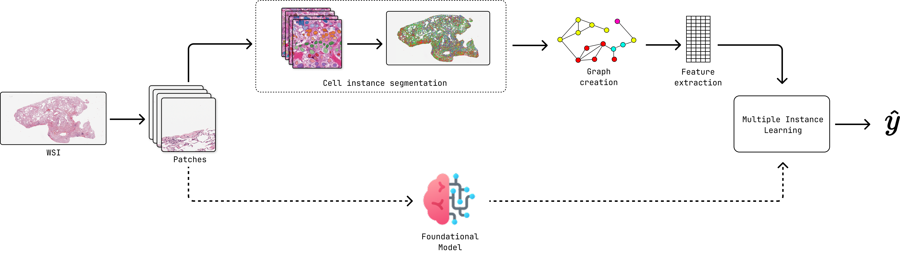

=======================================
Cell Instance Segmentation for Multiple Instance Learning in Digital Pathology
=======================================

Python package for cell instance segmentation and multiple instance learning (MIL) in digital pathology. It provides a complete pipeline from patch extraction to MIL model training and prediction.

.. image:: https://img.shields.io/badge/python-3.10+-blue.svg
   :alt: Python Version
   :target: https://python.org

   Overview of the cell instance segmentation and multiple instance learning pipeline.

Features
========

- **Patch Extraction**: Extract patches from whole slide images (WSI) with configurable parameters
- **Cell Segmentation**: Multiple segmentation models including CellViT, HoverNet, and Cellpose
- **Graph Creation**: Create spatial graphs from segmented cells for improved context understanding
- **Feature Extraction**: Extract morphological and radiomics features from segmented cells
- **Visualization**: Comprehensive feature visualization tools

Quick Start
===========

Development Setup
-----------------

For users who want to modify the code or contribute to the project. This is the **recommended** approach for researchers and developers.

**1. Clone the Repository**

.. code-block:: bash

   git clone https://github.com/CamiloSinningUN/CellMIL.git
   cd CellMIL

**2. Create Conda Environment**

.. note::

   This step can be skipped if you already have Python 3.10 and Poetry installed on your machine.

.. code-block:: bash

   # Create environment
   conda env create -f environment.yml

   # Activate environment
   conda activate cellmil

**3. Install Python Dependencies**

.. code-block:: bash

   poetry install

.. note::

   Poetry will install PyTorch with CUDA 11.8 support. If you have a GPU with an older CUDA version, install PyTorch manually first before running ``poetry install``. Visit `pytorch.org <https://pytorch.org/get-started/locally/>`_ to get the correct command for your system.

**4. Install Additional Dependencies**

.. code-block:: bash

   # Pyradiomics (incompatible with Poetry resolver)
   pip install pyradiomics

.. note::

   **Optional:** Install cucim for GPU-accelerated image loading from their `official documentation <https://docs.rapids.ai/api/cucim/stable/>`_

Basic Usage
-----------

1. **Extract patches from WSI**:

.. code-block:: bash

   patch_extraction --output_path ./results --wsi_path ./data/SLIDE_1.svs --patch_size 1024 --patch_overlap 6.25 --target_mag 20.0

2. **Run cell segmentation**:

.. code-block:: bash

   cell_segmentation --model cellvit --gpu 0 --wsi_path ./data/SLIDE_1.svs --patched_slide_path ./results/SLIDE_1

3. **Graph creation**:
   
.. code-block:: bash

   graph_creation  --method delaunay_radius --gpu 0 --patched_slide_path ./results/SLIDE_1  --segmentation_model cellvit

   4.1. **Morphological features**:

   .. code-block:: bash

      feature_extraction  --extractor pyradiomics_hed  --patched_slide_path ./results/SLIDE_1  --segmentation_model cellvit

   4.2. **Topological features**:

   .. code-block:: bash

      feature_extraction  --extractor connectivity --patched_slide_path ./results/SLIDE_1  --segmentation_model cellvit --graph_method delaunay_radius

   4.3. **Embedding features**:

   .. code-block:: bash

      feature_extraction  --extractor resnet50 --patched_slide_path ./results/SLIDE_1 

Documentation Contents
======================

.. toctree::
   :maxdepth: 2
   :caption: User Guide

   installation
   quickstart
   cli
   pipeline/index
   explainability

.. toctree::
   :maxdepth: 2
   :caption: API Reference

   api/index

.. toctree::
   :maxdepth: 1
   :caption: Development

   contributing
   changelog

Indices and tables
==================

* :ref:`genindex`
* :ref:`modindex`
* :ref:`search`
