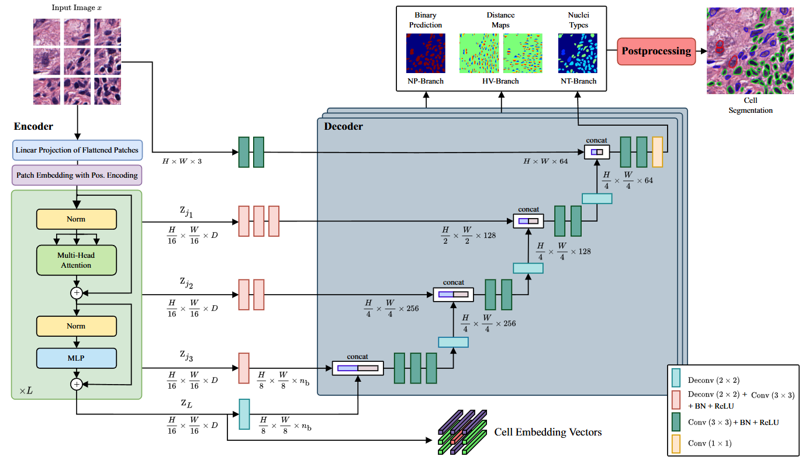
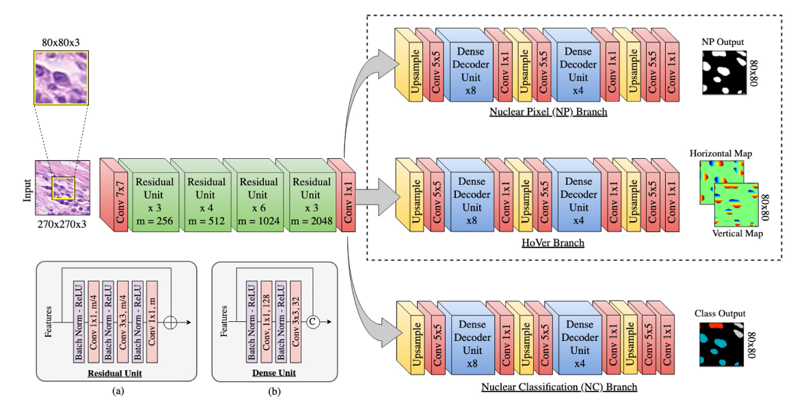
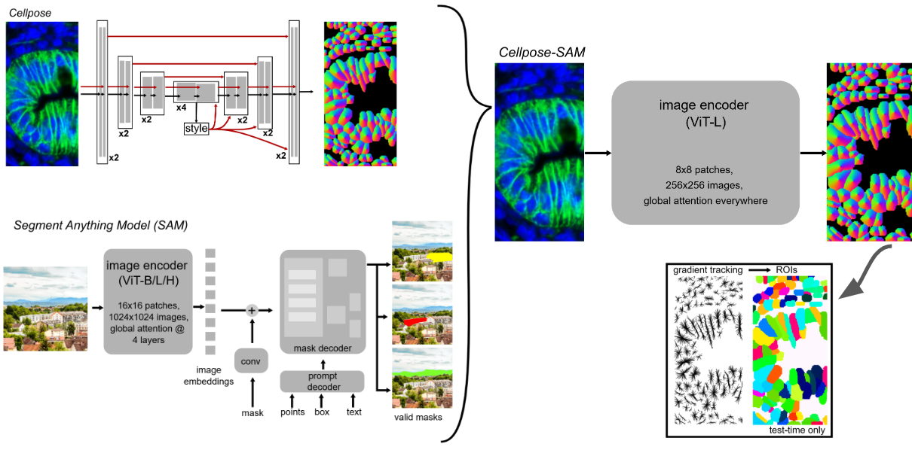

================
Cell Segmentation
================

The cell segmentation tool identifies and segments individual cells within extracted patches using deep learning models. This is the second step in the pipeline.

Overview
========

Cell segmentation transforms patch images into cell instance masks and metadata, enabling downstream feature extraction and analysis. The tool supports multiple segmentation models, each optimized for different cell types and imaging conditions.

Available Models
===============

CellViT [#cellvit]_
-------

Vision transformer-based model for nuclear instance segmentation and classification.

   
.. [#cellvit] Hörst, F., Rempe, M., Heine, L., Seibold, C., Keyl, J., Baldini, G., Ugurel, S., Siveke, J., Grünwald, B., Egger, J., & Kleesiek, J. (2024). CellViT: Vision Transformers for precise cell segmentation and classification. Medical Image Analysis, 94, 103143. https://doi.org/10.1016/j.media.2024.103143
   :width: 100%
   :align: center

HoVerNet [#hovernet]_
--------

Horizontal and vertical distance regression network for nuclear instance segmentation.

.. [#hovernet] Graham, S., Vu, Q. D., Raza, S. E. A., Azam, A., Tsang, Y. W., Kwak, J. T., & Rajpoot, N. (2019). Hover-net: Simultaneous segmentation and classification of nuclei in multi-tissue histology images. Medical Image Analysis, 101563. https://doi.org/10.1016/j.media.2019.101563

Cellpose + SAM [#cellpose_sam]_
--------------

Combination of Cellpose with Segment Anything Model (SAM) for enhanced cell segmentation.

.. note::
   **Cell Type Limitation:** Cellpose+SAM only provides cell segmentation masks and does not classify cell types. If you need cell type information (required for Head4Type model), use CellViT or HoVerNet instead.

.. [#cellpose_sam] Pachitariu, M., Rariden, M., & Stringer, C. (2025). Cellpose-SAM: superhuman generalization for cellular segmentation. bioRxiv. https://doi.org/10.1101/2025.04.28.651001

CLI Usage
=========

.. note::
   ⭐ indicates recommended options based on best practices and empirical results.

Basic Command
-------------

.. code-block:: bash

   cell_segmentation [OPTIONS]

Required Arguments
------------------

.. option:: --model {cellvit,hovernet,cellpose_sam}

   Segmentation model to use. Choose based on your specific requirements and cell types.
   
   - ``cellvit``: ⭐ Recommended. Provides cell type information.
   - ``hovernet``: Provides cell type information.
   - ``cellpose_sam``: Does not provide cell type information.

.. option:: --wsi_path PATH

   Path to the original whole slide image file. Used for metadata and coordinate mapping.

.. option:: --patched_slide_path PATH

   Path to the directory containing extracted patches (output from patch extraction step).

Optional Arguments
------------------

.. option:: --gpu INTEGER

   GPU device ID to use for computation.
   
   *Default: 0*

Complete Example
----------------

.. code-block:: bash

   cell_segmentation \
       --model cellvit \
       --gpu 0 \
       --wsi_path ./data/SLIDE_1.svs \
       --patched_slide_path ./results/SLIDE_1

This command will:

1. Load patches from ``./results/SLIDE_1/patches/``
2. Apply CellViT segmentation model using GPU 0
3. Generate cell masks and metadata
4. Save results to ``./results/SLIDE_1/cell_detection/cellvit/``

Python API Usage
================

You can also perform cell segmentation programmatically:

.. code-block:: python

   from cellmil.segmentation import CellSegmenter
   from cellmil.interfaces import CellSegmenterConfig
   from pathlib import Path

   # Create configuration
   config = CellSegmenterConfig(
       model="cellvit",
       gpu=0,
       wsi_path=Path("./data/SLIDE_1.svs"),
       patched_slide_path=Path("./results/SLIDE_1")
   )

   # Initialize segmenter
   segmenter = CellSegmenter(config)
   
   # Process patches
   segmenter.process()

Output Structure
===============

Cell segmentation creates the following files:

.. code-block:: text

   patched_slide_path/
   └── cell_detection/
       └── {model_name}/
           ├── cells.json          # Cell instance metadata
           ├── cells.geojson       # Spatial cell data for visualization
           ├── cell_detection.json # Detection metadata
           └── cell_detection.geojson  # Spatial detection data

File Descriptions
----------------

**cells.json**
   Contains cell instance information including:
   
   - Cell boundaries and centroids
   - Patch coordinates and mappings
   - Classification scores (if applicable)

**cells.geojson**
   Spatial representation of cells in GeoJSON format for visualization in tools like QuPath.

**cell_detection.json**
   Detection-level metadata including:
   
   - Detection confidence scores
   - Centroids and bounding boxes

Quality Assessment
=================

Visual Inspection
----------------

After segmentation, inspect results by:

1. Loading GeoJSON files in QuPath or similar viewer
2. Checking cell detection accuracy on representative patches
3. Verifying segmentation quality in different tissue regions

Integration with Pipeline
========================

Cell segmentation output is used by:

1. **Feature Extraction**: Extract morphological features from segmented cells
2. **Graph Creation**: Create spatial graphs from segmented cells

The standardized output format ensures compatibility with downstream tools.

See Also
========

- :doc:`patch_extraction` - Previous step in the pipeline
- :doc:`graph_creation` - Next step in the pipeline
- :doc:`feature_extraction` - Next step in the pipeline
- :doc:`../api/_autosummary/cellmil.segmentation` - API documentation
- :doc:`../quickstart` - Complete pipeline overview
