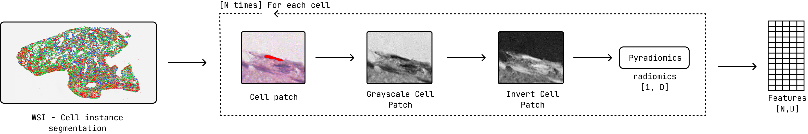
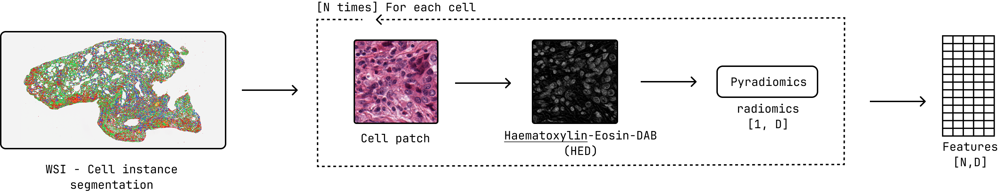
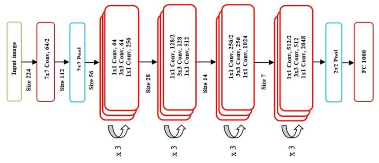
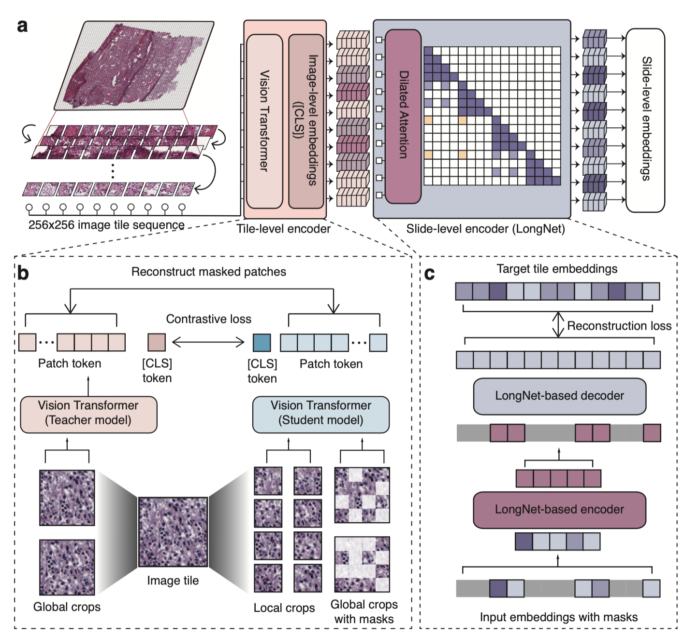

==================
Feature Extraction
==================

The feature extraction tool extracts features from segmented cells. This is the third step in the pipeline, transforming cell masks and detection into quantitative feature vectors for downstream analysis.

Overview
========

Feature extraction bridges the gap between visual cell segmentation and quantitative analysis. It computes numerical descriptors that capture cell morphology, intensity patterns, and texture characteristics, enabling machine learning and statistical analysis.

   Feature extraction pipeline overview, highlighting the use of PyRadiomics for feature computation with Gray Scale preprocessing.

   Feature extraction pipeline overview, highlighting the use of PyRadiomics for feature computation with HED decomposition preprocessing.

Available Extractors
====================

PyRadiomics [#pyradiomics]_
-----------

Comprehensive radiomics feature extraction based on the PyRadiomics library **(102 features)**.

**Shape Features** (7 features)
   - ``Area``: Number of pixels in the cell mask
   - ``Perimeter``: Length of cell boundary
   - ``Sphericity``: How sphere-like the cell is
   - ``Compactness``: Ratio of area to perimeter squared
   - ``Maximum2DDiameter``: Largest distance between boundary points

**First Order Features** (18 features)
   - ``Mean``: Average intensity within cell
   - ``StandardDeviation``: Intensity variation
   - ``Skewness``: Asymmetry of intensity distribution
   - ``Kurtosis``: Peakedness of intensity distribution
   - ``Entropy``: Randomness of intensity values

**Texture Features** (70+ features)
   - **GLCM**: Co-occurrence patterns
   - **GLRLM**: Run-length patterns  
   - **GLSZM**: Size zone patterns
   - **NGTDM**: Neighboring tone differences
   - **GLDM**: Dependence patterns

.. [#pyradiomics] van Griethuysen, J. J. M., Fedorov, A., Parmar, C., Hosny, A., Aucoin, N., Narayan, V., Beets-Tan, R. G. H., Fillion-Robin, J. C., Pieper, S., Aerts, H. J. W. L. (2017). Computational Radiomics System to Decode the Radiographic Phenotype. Cancer Research, 77(21), e104–e107. https://doi.org/10.1158/0008-5472.CAN-17-0339

Morphometrics
-------------------

Morphological features based on established cellular analysis literature **(13 features)**.

**Features:**
   - ``axial_ratio``: Ratio of bounding box width to height
   - ``aspect_ratio``: Ratio of major to minor axis of fitted ellipse
   - ``eccentricity``: Ratio of minor to major axis length
   - ``rectangular_factor``: Area divided by product of major and minor axis lengths
   - ``elongation_index``: Log2 of major to minor axis length ratio
   - ``dispersion_index``: Log2 of π × major_axis × minor_axis
   - ``circularity``: 4π × area / perimeter²
   - ``roundness``: Perimeter / √(4π × area)
   - ``roundness_factor``: 4 × area / (π × max_diameter²)
   - ``convexity``: Convex hull perimeter / perimeter
   - ``spreading_index``: (π × convex_hull_perimeter) / (4 × convex_hull_area)
   - ``irregularity_index``: Max diameter / inscribed circle diameter
   - ``solidity``: Cell area / convex hull area

Reference: `Functional Morphometric Analysis in Cellular Behaviors: Shape and Size Matter <http://dx.doi.org/10.1002/adhm.201300053>`_

Connectivity
-------------------

Connectivity features based on the spatial graph of segmented cells **(5 features)**.

**Features:**
   - ``degree``: Number of adjacent cells (graph degree)
   - ``weighted_degree``: Sum of edge weights (distance-based)
   - ``k_core_number``: Maximum k-core value for the cell in the graph
   - ``pagerank``: PageRank centrality score
   - ``eigenvector_centrality``: Eigenvector centrality (approximate)

.. Structure
.. -------------------

.. Structure features based on cell shape and arrangement **(4 features)**.

.. **Features:**
..    - ``clustering_coefficient``: Fraction of connected neighbors
..    - ``weighted_clustering_coefficient``: Weighted clustering coefficient (by distance)
..    - ``local_efficiency``: Efficiency of local subgraph
..    - ``ego_network_density``: Density of ego-network

Geometric
-------------------

Geometric features based on cell shape and arrangement **(10 features)**.

**Features:**
   - ``distance_to_nearest_neighbor``: Minimum distance to another cell
   - ``mean_distance_to_neighbors``: Mean distance to all neighbors
   - ``edge_length_variance``: Variance of edge lengths to neighbors
   - ``anisotropy``: Dominant direction of nearest neighbors
   - ``local_density``: Number of cells within a fixed radius
   - ``spatial_entropy_of_neighbors``: Entropy of neighbor spatial distribution
   - ``local_convex_hull_shape``: Shape descriptor of local convex hull
   - ``area_perimeter_ratio_local_neighborhood``: Area/perimeter ratio of local neighborhood
   - ``nucleus_size_relative_to_local_density``: Nucleus size normalized by local density
   - ``relative_orientation_of_neighbors``: Orientation difference between cell and neighbors

ResNet50 [#resnet]_
-------------------

ResNet50 is a deep residual network that can be used for feature extraction from images. In the context of this package, it is applied to the patches extracted from whole slide images to obtain high-level embeddings. **(1024 features)** We take the output from the stage 3 convolutional block.

   ResNet50 model architecture.

.. [#resnet] He, K., Zhang, X., Ren, S., & Sun, J. (2016). Deep residual learning for image recognition. In Proceedings of the IEEE conference on computer vision and pattern recognition (pp. 770-778).

Prov-Gigapath [#gigapath]_
-------------------

Prov-Gigapath is a foundational model specifically designed for analyzing gigapixel pathology images.

   Prov-Gigapath model architecture.

.. [#gigapath] Xu, H., Usuyama, N., Bagga, J. et al. A whole-slide foundation model for digital pathology from real-world data. Nature 630, 181–188 (2024). https://doi.org/10.1038/s41586-024-07441-w

UNI [#uni]_
-------------------

UNI is a general-purpose self-supervised vision transformer model pretrained on over 100 million images from diverse tissue types and organs. It provides robust embedding features suitable for pathology image analysis. **(1536 features)**

.. [#uni] Chen, R.J., Ding, T., Lu, M.Y. et al. Towards a general-purpose foundation model for computational pathology. Nat Med 30, 850–862 (2024).

CLI Usage
=========

.. note::
   ⭐ indicates recommended options based on best practices and empirical results.

Basic Command
-------------

.. code-block:: bash

   feature_extraction [OPTIONS]

Required Arguments
------------------

.. option:: --extractor {pyradiomics_gray, pyradiomics_hue, pyradiomics_hed, morphometrics, connectivity, geometric, resnet50, gigapath, uni}

   Feature extraction method to use.
   
   **Morphological extractors:**
   
   - ``pyradiomics_gray``: Comprehensive radiomics features with gray-scale preprocessing
   - ``pyradiomics_hed``: ⭐ Recommended. Radiomics features from Hematoxylin channel
   - ``pyradiomics_hue``: Radiomics features with Hue channel preprocessing
   - ``morphometrics``: Morphological shape features
   
   **Topological extractors:**
   
   - ``connectivity``: Topological features based on cell connectivity
   - ``geometric``: Geometric features based on graph geometry
   
   **Deep learning extractors:**
   
   - ``resnet50``: ResNet50 embedding features
   - ``gigapath``: Prov-GigaPath embedding features
   - ``uni``: UNI embedding features

.. option:: --wsi_path PATH

   Path to the original whole slide image file.

.. option:: --patched_slide_path PATH

   Path to the directory containing segmentation results.

.. option:: --segmentation_model {cellvit,hovernet,cellpose_sam}

   The segmentation model used in the previous step. Must match the model used for cell segmentation.

..option:: --graph_method {knn, radius, delaunay_radius, dilate}

   Method for constructing the cell adjacency graph.

Complete Example
----------------

.. code-block:: bash

   feature_extraction \
       --extractor pyradiomics_hed \
       --wsi_path ./data/SLIDE_1.svs \
       --patched_slide_path ./results/SLIDE_1 \
       --segmentation_model cellvit \
       --graph_method delaunay_radius

This command will:

1. Load cell masks from ``./results/SLIDE_1/cell_detection/cellvit/``
2. Extract PyRadiomics features from each segmented cell using HED preprocessing (recommended).
3. Save feature vectors to ``./results/SLIDE_1/feature_extraction/pyradiomics_hed/cellvit/``

Python API Usage
================

You can also extract features programmatically:

.. code-block:: python

   from cellmil.features import FeatureExtractor
   from cellmil.interfaces import FeatureExtractorConfig
   from pathlib import Path

   # Create configuration
   config = FeatureExtractorConfig(
       extractor="pyradiomics_hed",
       wsi_path=Path("./data/SLIDE_1.svs"),
       patched_slide_path=Path("./results/SLIDE_1"),
       segmentation_model="cellvit",
       graph_method="delaunay_radius"
   )

   # Initialize extractor
   extractor = FeatureExtractor(config)
   
   # Extract features
   features = extractor.get_features()
   
   # Features are returned as a tensor of shape [N, D]
   # where N is the number of cells and D is the number of features
   print(f"Extracted features for {features.shape[0]} cells")
   print(f"Feature dimensionality: {features.shape[1]}")

Output Structure
===============

Feature extraction creates the following structure:

.. code-block:: text

   patched_slide_path/
   └── feature_extraction/
       └── {extractor_name}/
           └── {segmentation_model}/
               └── features.pt         # Feature tensor [N, D]

File Descriptions
----------------

**features.pt**
   PyTorch tensor containing a dictionary with:
      1. features: Shape: [N, D] where N = number of cells, D = number of features
      2. feature_names: List of feature names
      3. cell_indices: List of cell indices mapping cell_id -> index in feature matrix

   - Can be loaded with ``torch.load()``

Quality Control
==============

Feature Validation
-----------------

The tool performs automatic quality checks:

- **Cell size validation**: Filters cells below minimum size threshold
- **Mask integrity**: Ensures cell masks are valid
- **Feature validity**: Checks for NaN or infinite values
- **Extraction success**: Verifies successful feature computation

Quality Metrics
--------------

Generated quality metrics include:

- Number of cells processed successfully
- Number of cells filtered out
- Feature extraction success rate
- Processing time statistics

Data Analysis
============

For statistical analysis and visualization of extracted features, you can refer to the visualization tools provided in the package. See :doc:`../cli`. Which includes:

- **Feature distribution plots**: Histograms and boxplots for feature distributions
- **Correlation matrices**: Heatmaps to visualize feature correlations
- **Dimensionality reduction**: PCA to visualize feature space

Integration with Pipeline
========================

Feature extraction output is used by:

1. **MIL Prediction**: Features serve as input to multiple instance learning models
2. **Visualization**: Feature distributions and patterns can be visualized
3. **ML Training**: Features are used to train classification models

The standardized tensor format ensures compatibility with PyTorch-based models.

See Also
========

- :doc:`cell_segmentation` - Previous step in the pipeline 
- :doc:`../api/_autosummary/cellmil.features` - API documentation
- :doc:`../quickstart` - Complete pipeline overview
