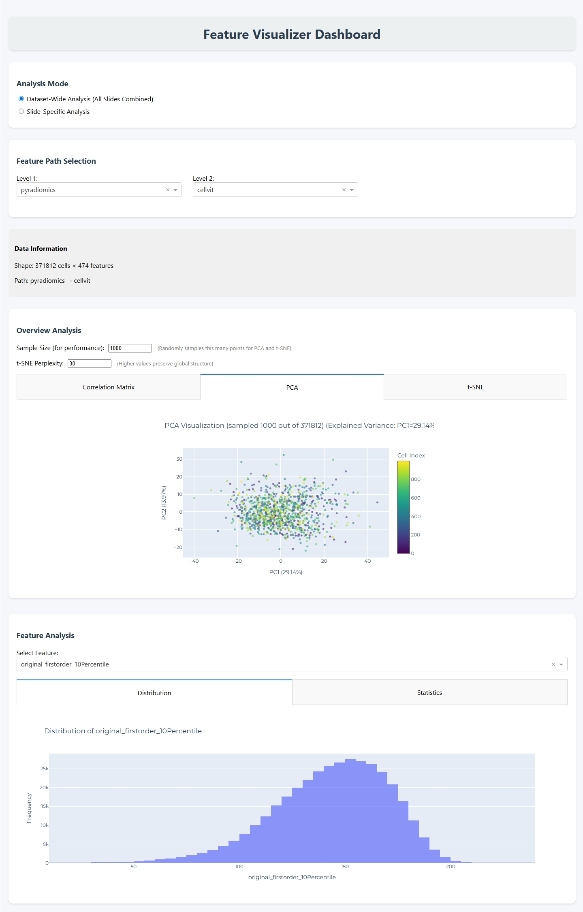

=====================
Feature Visualization
=====================

The feature visualization tool provides interactive visual analysis and statistical exploration of extracted features from your dataset. It enables comprehensive examination of feature distributions, correlations, dimensionality reduction, and cell-type-specific patterns through an interactive web interface.

Overview
========

Feature visualization helps you understand the characteristics and quality of your extracted features before training MIL models.

The tool provides:

- **Statistical descriptors**: Mean, median, standard deviation, skewness, and kurtosis
- **Distribution analysis**: Histograms and kernel density estimates
- **Correlation analysis**: Feature correlation matrices
- **Dimensionality reduction**: PCA and t-SNE visualizations
- **Cell-type analysis**: Cell type distributions and feature comparisons across cell types
- **Multi-slide analysis**: Combined visualizations across entire datasets

CLI Usage
=========

Basic Command
-------------

.. code-block:: bash

   vis_features --dataset PATH

Required Arguments
------------------

.. option:: --dataset PATH

   Path to the dataset folder containing slides with extracted features. This should be the output directory from feature extraction or dataset creation steps.

Complete Example
----------------

.. code-block:: bash

   vis_features --dataset ./results/my_dataset

This command will:

1. Launch an interactive web application at ``http://127.0.0.1:8050``
2. Scan the dataset for available slides and feature extraction outputs
3. Provide interactive controls to navigate through different feature sets
4. Generate visualizations on-demand based on your selections

See Also
========

- :doc:`feature_extraction`: Extract features before visualization
- :doc:`dataset_creation`: Create organized datasets for analysis
- :doc:`../api/_autosummary/cellmil.visualization`: API reference for the visualization module
