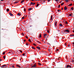

================
Graph Creation
================

The graph creation tool uses the cells segmentation location to build a spatial graph representation of the tissue architecture. This graph captures the relationships between individual cells based on their proximity and connectivity.

Available methods
================

K-Nearest Neighbors (KNN)
---------------------------

KNN is a popular method for graph construction, where each cell is connected to its K nearest neighbors based on spatial proximity.

The function is a wrapper around the function provided by torch_geometric ::func:`torch_geometric.nn.pool.knn_graph`.

Radius-based
------------

Radius-based graph construction connects each cell to all other cells within a specified radius. 

The function is a wrapper around the function provided by torch_geometric ::func:`torch_geometric.nn.pool.radius_graph`.

Delaunay Triangulation
-----------------------

Delaunay triangulation creates a graph by connecting cells based on the Delaunay criterion, which maximizes the minimum angle of the triangles formed.

This function makes use of function provided by scipy ::func:`scipy.spatial.Delaunay` for building the Delaunay triangulation. After, it constructs a graph by connecting the cells based on the triangles formed.

Nuclei Dilation
---------------

Nuclei dilation is a method that expands the boundaries of each cell's nucleus to create a more inclusive graph representation. 

This function is was heavily inspired by the QuPath process of cell instance segmentation which utilizes a similar approach for making cell boundaries.

   QuPath Cell boundary approximation.

Our method builds upon this concept by dilating the nuclei of the cell by a fix number of pixels and then checking for overlaps with neighboring cells.

Similarity
----------

The similarity-based graph creation method connects cells based on a weighted sum or product of similarity of their morphological features and spatial proximity. 

.. math::

   S_{ij} = \alpha \cdot \text{FeatureSim}(i, j) + (1 - \alpha) \cdot \text{SpatialSim}(i, j)

or 

.. math::

   S_{ij} = \text{FeatureSim}(i, j) \times \text{SpatialSim}(i, j)

Where :math:`S_{ij}` is the similarity score between cells :math:`i` and :math:`j`, :math:`\alpha` is a weighting factor, :math:`\text{FeatureSim}(i, j)` is the similarity based on morphological features (from Morphometrics and Pyradiomics), and :math:`\text{SpatialSim}(i, j)` is the spatial proximity measure.

CLI Usage
=========

Basic Command
-------------

.. code-block:: bash

   poetry run graph_creation [OPTIONS]

Required Arguments
------------------

.. option:: method {knn, radius, delaunay_radius, dilate}

   Graph creation method to use. Choose based on your specific preference.

.. option:: gpu: INTEGER

    GPU device ID to use for computation.

.. option:: patched_slide_path PATH

   Path to the directory containing segmentation results. This should contain the cell segmentation masks.

.. option_model:: segmentation_model {cellvit, hovernet, cellpose_sam}

    Segmentation model to use for cell segmentation. Choose based on your specific requirements and preferences.

Optional Arguments
------------------  

.. option:: plot

   Whether to plot the graph after creation.

Complete Example
----------------

.. code-block:: bash

   poetry run graph_creation --method knn --gpu 0 --patched_slide_path /path/to/segmentation/results --segmentation_model cellvit

This command will:

1. Use the K-Nearest Neighbors (KNN) method for graph creation.
2. Utilize GPU device 0 for computation.
3. Specify the path to the directory containing segmentation results.
4. Use the CellViT segmentation model for cell segmentation.

Python API Usage
----------------    

.. code-block:: python

    from cellmil.interfaces import GraphCreatorConfig
    from cellmil.graph import GraphCreator

    config = GraphCreatorConfig(
        method="knn",
        gpu=0,
        patched_slide_path=Path("/path/to/segmentation/results"),
        segmentation_model="cellvit",
        plot=True
    )

    graph_creator = GraphCreator(config)

    graph = graph_creator.create_graph()

Output Structure
===============

Graph creation creates the following files:

.. code-block:: text

   patched_slide_path/
   └── graph/
       └── {model_name}/
           ├── graph.pt
           └── graph.png

File Descriptions
=================

**graph.pt**
   The main graph file containing the graph structure and metadata.

**graph.png**
   A visual representation of the graph, useful for debugging and analysis.

Integration with Pipeline
=========================

Graph creation output is used by:

1. **Feature Extraction**: Extract morphological features from segmented cells

The standardized output format ensures compatibility with downstream tools.

See Also
========

- :doc:`feature_extraction` - Next step in the pipeline
- :doc:`../api/_autosummary/cellmil.segmentation` - API documentation
- :doc:`../quickstart` - Complete pipeline overview
