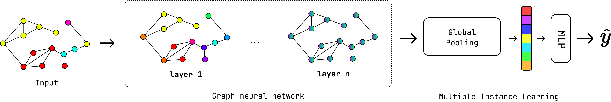

===================================
MIL Training
===================================

This tutorial guides you through building custom Multiple Instance Learning (MIL) training scripts using the CellMIL API. You'll learn how to configure datasets, select models, apply preprocessing transforms, and train deep learning models on preprocessed whole slide image data.

.. contents:: Table of Contents
   :depth: 3
   :local:

Overview
========

Multiple Instance Learning (MIL) enables training models on whole slide images (WSI) using only slide-level labels. Each slide is treated as a "bag" of cell instances, and the model learns to aggregate cell-level features to predict slide-level outcomes such as:

- Binary classification (e.g., responder vs non-responder)
- Survival prediction (time-to-event outcomes)

Available Models
================

CLAM (Clustering-constrained Attention MIL) [#clam]_
-----------------------------------------------------

Attention-based MIL model with clustering constraints for improved interpretability.

.. figure:: ../_static/our_clam.png
   :alt: CLAM Model Architecture
   :width: 100%
   :align: center

.. [#clam] Lu, M. Y., Williamson, D. F., Chen, T. Y., Chen, R. J., Barbieri, M., & Mahmood, F. (2021). Data-efficient and weakly supervised computational pathology on whole-slide images. Nature Biomedical Engineering, 5(6), 555-570.

Attention MIL
-------------

Deep attention-based MIL with multi-head attention mechanisms.

Head4Type
------------

Using the types of cells identified in the segmentation step (Neoplastic, Inflammatory, Connective), this model uses separate attention heads for each cell type to better capture their distinct contributions to the slide-level prediction.

CellConv
-------------

This model uses convolutional layers to leverage local patterns in cell features inherent to the pipeline organization. To then use attention pooling for slide-level predictions.

GraphMIL
---------

Graph neural network-based MIL that leverages spatial relationships between cells. This metamodel allows you to plug in different GNN architectures for cell graph processing and different MIL pooling strategies.

Available GNN architectures include:
- GraphSAGE
- GAT
- EGNN
- SegFormer
- others

Available MIL pooling methods include:
- Attention pooling
- Mean pooling
- others

Building Training Script
====================================

Basic Setup
-----------

Start with the essential imports and configuration:

.. code-block:: python

   from pathlib import Path
   import pandas as pd
   import lightning as Pl
   from cellmil.interfaces import MILTrainerConfig
   from cellmil.interfaces.MIL import MILType
   from cellmil.interfaces.CellSegmenterConfig import ModelType
   from cellmil.interfaces.FeatureExtractorConfig import ExtractorType
   from cellmil.interfaces.GraphCreatorConfig import GraphCreatorType
   from cellmil.datamodels.datasets import MILDataset

   # Define paths
   root_path = Path("./")
   dataset_path = root_path / "dataset"
   excel_path = root_path / "data" / "metadata.xlsx"

Configuration Object
--------------------

Create a ``MILTrainerConfig`` to specify all training parameters:

.. code-block:: python

   config = MILTrainerConfig(
       root=root_path / "MIL_dataset",  # Cache directory for processed data
       folder=dataset_path,              # Dataset created by dataset_creation tool
       excel_path=excel_path,            # Metadata with labels
       label="DCR",                      # Column name in Excel with target labels
       model=MILType.attention,          # MIL model architecture (Not actually used)
       extractor=ExtractorType.morphometrics,  # Feature type to use
       segmentation_model=ModelType.cellvit,   # Segmentation model used
       graph_creator=GraphCreatorType.delaunay_radius,  # For graph-based models
       gpu=0,                            # GPU device ID (0 for first GPU)
       ckpt_path=Path("./checkpoints"),  # Where to save model checkpoints
       normalization=True,               # Apply feature normalization
       correlation_filter=0.0,           # Remove correlated features (0.0 = disabled)
   )

Configuration Parameters
========================

Required Parameters
-------------------

.. list-table::
   :widths: 25 75
   :header-rows: 1

   * - Parameter
     - Description
   * - ``root``
     - Cache directory where processed datasets are stored
   * - ``folder``
     - Path to the dataset directory (output from dataset creation)
   * - ``excel_path``
     - Path to Excel file containing slide metadata and labels
   * - ``label``
     - Column name in Excel file containing target labels
   * - ``extractor``
     - Feature extractor type or list of types
   * - ``segmentation_model``
     - Segmentation model used to generate cell masks
   * - ``ckpt_path``
     - Directory where model checkpoints will be saved

Feature Extractors
------------------

You can use single or multiple feature extractors:

**Single Extractor:**

.. code-block:: python

   config = MILTrainerConfig(
       extractor=ExtractorType.morphometrics,
       # ... other parameters
   )

**Multiple Extractors (Concatenated):**

.. code-block:: python

   config = MILTrainerConfig(
       extractor=[
           ExtractorType.morphometrics,
           ExtractorType.pyradiomics_hed,
           ExtractorType.connectivity,
           ExtractorType.geometric,
       ],
       # ... other parameters
   )

Available extractors:

- ``morphometrics``: Cell shape and size features
- ``pyradiomics_hed``: Texture features from H&E deconvolution
- ``pyradiomics_gray``: Texture features from grayscale
- ``connectivity``: Graph connectivity features
- ``geometric``: Spatial geometric features
.. - ``structure``: Structural topology features
- ``resnet50``: Deep learning embeddings (ResNet-50)
- ``gigapath``: Foundation model embeddings (GigaPath)

Optional Parameters
-------------------

.. list-table::
   :widths: 25 15 60
   :header-rows: 1

   * - Parameter
     - Default
     - Description
   * - ``gpu``
     - ``0``
     - GPU device ID (0 for first GPU)
   * - ``normalization``
     - ``False``
     - Apply robust scaling normalization
   * - ``correlation_filter``
     - ``0.0``
     - Threshold for removing correlated features (0.0-1.0)
   * - ``cell_type``
     - ``False``
     - Include cell type information as features
   * - ``n_bins``
     - ``4``
     - Number of bins for survival analysis tasks
   * - ``graph_creator``
     - Required for ``graphmil`` and when using graph-based features
     - Graph construction method

Loading and Preparing Data
===========================

Basic Data Loading (Recommended)
--------------------------------

The recommended approach is to load the full dataset without splitting, and let the k-fold cross-validation handle the train/validation splits automatically:

.. code-block:: python

   # Load metadata
   df = pd.read_excel(config.excel_path)
   
   # Filter to samples with valid labels
   df = df[df[config.label].isin([0, 1])]
   df = df.dropna(subset=[config.label])
   df[config.label] = df[config.label].astype(int)
   
   # Save filtered data for reproducibility
   data_path = Path(f"./data/{experiment_name}.csv")
   data_path.parent.mkdir(parents=True, exist_ok=True)
   df.to_csv(data_path, index=False)
   
   # Create the full dataset (no split parameter)
   dataset = MILDataset(
       root=config.root,
       label=config.label,
       folder=config.folder,
       data=df,
       extractor=config.extractor,
       segmentation_model=config.segmentation_model,
       graph_creator=config.graph_creator,  # Required for graph-based features
   )
   
   print(f"Dataset size: {len(dataset)}")
   print(f"Feature dimension: {dataset[0][0].shape}")

.. note::
   
   By not specifying the ``split`` parameter, all samples in the DataFrame are included.
   The k-fold cross-validation will automatically create stratified train/validation splits
   for each fold.

Manual Train/Val Splits (Alternative)
-------------------------------------

If you prefer manual control over splits (e.g., for a held-out test set), you can use the ``split`` parameter:

.. code-block:: python

   from sklearn.model_selection import train_test_split
   
   # Load metadata
   df = pd.read_excel(config.excel_path)
   df = df[df[config.label].isin([0, 1])]
   
   # Create train/val split (80/20)
   train_df, val_df = train_test_split(
       df, 
       test_size=0.2, 
       stratify=df[config.label],  # Maintain class balance
       random_state=42
   )
   
   # Add split column
   train_df['SPLIT'] = 'train'
   val_df['SPLIT'] = 'val'
   df = pd.concat([train_df, val_df])
   
   # Save split information
   df.to_csv("./data/data_with_splits.csv", index=False)
   
   # Create datasets with split filtering
   train_dataset = MILDataset(
       root=config.root,
       label=config.label,
       folder=config.folder,
       data=df,
       extractor=config.extractor,
       segmentation_model=config.segmentation_model,
       split="train",  # Only samples with SPLIT="train"
   )
   
   val_dataset = MILDataset(
       root=config.root,
       label=config.label,
       folder=config.folder,
       data=df,
       extractor=config.extractor,
       segmentation_model=config.segmentation_model,
       split="val",  # Only samples with SPLIT="val"
   )

Data Transforms
===============

Feature Transforms
------------------

Apply preprocessing transforms to your features:

.. code-block:: python

   from cellmil.datamodels.transforms import (
       TransformPipeline,
       CorrelationFilterTransform,
       RobustScalerTransform,
   )
   
   # Create transform pipeline
   transforms = TransformPipeline([
       CorrelationFilterTransform(
           correlation_threshold=0.95,  # Remove features correlated > 0.95
           plot_correlation_matrix=False,
       ),
       RobustScalerTransform(
           apply_log_transform=True,  # Apply log transformation before scaling
       ),
   ])
   
   # Fit transforms on training data
   transforms.fit(train_dataset)
   
   # Apply to both train and validation
   train_dataset.transforms = transforms
   val_dataset.transforms = transforms

Available Transforms:

- ``CorrelationFilterTransform``: Remove highly correlated features
- ``RobustScalerTransform``: Robust feature normalization
- Custom transforms can be created by subclassing ``Transform``

Filtering Data
==============

Cell Type Filtering
-------------------

Include only specific cell types in your analysis:

.. code-block:: python

   dataset = MILDataset(
       root=config.root,
       label=config.label,
       folder=config.folder,
       data=df,
       extractor=config.extractor,
       segmentation_model=config.segmentation_model,
       split="train",
       cell_types_to_keep=["Neoplastic", "Inflammatory"],  # Only these cell types
   )

Available cell types (for CellViT and HoVerNet):
- ``Neoplastic``
- ``Inflammatory``
- ``Connective``
- ``Dead``
- ``Epithelial``

ROI Filtering
-------------

Filter cells to only those within specific regions of interest:

.. code-block:: python

   dataset = MILDataset(
       root=config.root,
       label=config.label,
       folder=config.folder,
       data=df,  # Must contain 'ID', 'I3LUNG_ID', 'CENTER' columns
       extractor=config.extractor,
       segmentation_model=config.segmentation_model,
       split="train",
       roi_folder=Path("./data/rois"),  # Folder with ROI CSV files
   )

Model Training
==============

K-Fold Cross-Validation (Recommended)
-------------------------------------

The recommended approach for training and evaluating MIL models is using k-fold cross-validation.
This provides more robust performance estimates and automatically handles train/validation splitting.

The ``k_fold_train_eval`` function handles:

- Stratified k-fold splitting (maintains class balance in each fold)
- Proper transform fitting (only on training data per fold)
- Label transform fitting (e.g., time discretization for survival analysis)
- Automatic checkpoint management (keeps only the best fold)
- Logging to Weights & Biases (wandb)
- Cell count balancing (optional)

**Basic K-Fold Training:**

.. code-block:: python

   from cellmil.utils.train.evals import k_fold_train_eval
   from cellmil.datamodels.transforms import TransformPipeline, RobustScalerTransform
   
   # Create transform pipeline (will be fit separately on each fold's training data)
   transforms = TransformPipeline([
       RobustScalerTransform(apply_log_transform=True)
   ])
   
   # Define model creator function (called fresh for each fold)
   def lit_model_creator(input_dim: int) -> Pl.LightningModule:
       model = AttentionDeepMIL(
           embed_dim=input_dim,
           size_arg=[256, 128],
           n_classes=2,
           attention_branches=8,
           temperature=1.5,
       )
       
       optimizer = AdamW(model.parameters(), lr=1e-4)
       
       lit_model = LitAttentionDeepMIL(
           model=model,
           optimizer=optimizer,
           loss=FocalLoss(alpha=0.5, gamma=2.0),
           lr_scheduler=ReduceLROnPlateau(optimizer, mode="min", patience=5, factor=0.8)
       )
       
       return lit_model
   
   # Run k-fold cross-validation
   report = k_fold_train_eval(
       name="my_experiment",
       lit_model_creator=lit_model_creator,
       dataset=dataset,
       transforms=transforms,
       k=5,                          # Number of folds
       random_state=42,              # For reproducibility
       split_save_dir=Path("./data"),  # Save fold splits
       early_stopping_patience=30,
   )
   
   print(f"Cross-validation results: {report}")

K-Fold Parameters
-----------------

.. list-table::
   :widths: 25 15 60
   :header-rows: 1

   * - Parameter
     - Default
     - Description
   * - ``name``
     - Required
     - Experiment name for logging and checkpoints
   * - ``lit_model_creator``
     - Required
     - Function that takes ``input_dim`` and returns a fresh ``LightningModule``
   * - ``dataset``
     - Required
     - The full MIL dataset (no split)
   * - ``transforms``
     - ``None``
     - Transform pipeline (fit on each fold's training data)
   * - ``label_transforms``
     - ``None``
     - Label transforms (e.g., ``TimeDiscretizerTransform`` for survival)
   * - ``k``
     - ``5``
     - Number of cross-validation folds
   * - ``random_state``
     - ``42``
     - Random seed for reproducibility
   * - ``split_save_dir``
     - ``None``
     - Directory to save per-fold split information
   * - ``balance_cell_counts``
     - ``False``
     - Jointly stratify by label and cell-count quantiles
   * - ``cell_balance_bins``
     - ``5``
     - Number of quantile bins when balancing cell counts
   * - ``early_stopping_patience``
     - ``10``
     - Epochs without improvement before early stopping

Cell-Count Balanced Stratification
----------------------------------

When slides have varying numbers of cells, you can balance folds by cell count:

.. code-block:: python

   report = k_fold_train_eval(
       name="balanced_experiment",
       lit_model_creator=lit_model_creator,
       dataset=dataset,
       transforms=transforms,
       balance_cell_counts=True,    # Enable cell-count balancing
       cell_balance_bins=5,          # Number of quantile bins
   )

This creates a combined stratification target from labels and cell-count quantile bins,
ensuring each fold has similar distributions of both class labels and cell counts.

What K-Fold Does Internally
---------------------------

For each fold, ``k_fold_train_eval``:

1. **Splits data** using ``StratifiedKFold`` to maintain class balance
2. **Creates train/val subsets** using ``dataset.create_train_val_datasets()``
3. **Fits transforms** only on the training subset
4. **Applies transforms** to both train and validation
5. **Creates fresh model** using ``lit_model_creator``
6. **Trains** with early stopping and checkpointing
7. **Evaluates** and logs metrics to wandb
8. **Aggregates** results across all folds

Output Structure
----------------

After k-fold training, you'll find:

.. code-block:: text

   checkpoints/
   └── my_experiment/
       └── best_fold/
           ├── best_model.ckpt     # Best performing fold's checkpoint
           └── transforms/          # Fitted transforms from best fold
               ├── pipeline_config.json
               └── transform_0/
                   └── config.json
   
   data/
   └── my_experiment/
       ├── fold_1/
       │   ├── split.csv           # Slide IDs and their split assignment
       │   └── transforms/
       ├── fold_2/
       │   └── ...
       └── fold_5/

Complete Training Script (Recommended)
--------------------------------------

Here's a complete example using k-fold cross-validation:

.. code-block:: python

   import logging
   from pathlib import Path
   import pandas as pd
   import lightning as Pl
   from torch.optim import AdamW
   from torch.optim.lr_scheduler import ReduceLROnPlateau
   
   from cellmil.interfaces import MILTrainerConfig
   from cellmil.interfaces.MIL import MILType
   from cellmil.interfaces.CellSegmenterConfig import ModelType
   from cellmil.interfaces.FeatureExtractorConfig import ExtractorType
   from cellmil.interfaces.GraphCreatorConfig import GraphCreatorType
   from cellmil.datamodels.datasets import MILDataset
   from cellmil.models.mil.attentiondeepmil import AttentionDeepMIL, LitAttentionDeepMIL
   from cellmil.utils.train.evals import k_fold_train_eval
   from cellmil.utils.train import FocalLoss
   from cellmil.utils.train.dataset import complementary_frequencies
   from cellmil.datamodels.transforms import (
       TransformPipeline,
       CorrelationFilterTransform,
       RobustScalerTransform,
       Transform,
   )
   
   # Setup logging
   logging.basicConfig(
       level=logging.INFO,
       format="%(asctime)s - %(name)s - %(levelname)s - %(message)s",
   )
   logger = logging.getLogger(__name__)
   
   # Experiment name
   NAME = "DCR_morphometrics_attention"
   root_path = Path("./")
   
   # Configuration
   config = MILTrainerConfig(
       root=root_path / "MIL_dataset",
       label="DCR",
       model=MILType.attention,
       excel_path=root_path / "data" / "metadata.xlsx",
       folder=root_path / "dataset",
       gpu=0,
       extractor=ExtractorType.morphometrics,
       segmentation_model=ModelType.cellvit,
       graph_creator=GraphCreatorType.delaunay_radius,
       ckpt_path=Path(f"./checkpoints/{NAME}"),
       normalization=True,
       correlation_filter=0.0,
   )
   
   # Load and prepare data
   df = pd.read_excel(config.excel_path)
   df = df[df[config.label].isin([0, 1])]
   df = df.dropna(subset=[config.label])
   df[config.label] = df[config.label].astype(int)
   
   # Save filtered data
   data_path = Path(f"./data/{NAME}.csv")
   data_path.parent.mkdir(parents=True, exist_ok=True)
   df.to_csv(data_path, index=False)
   
   # Create full dataset (no split parameter)
   dataset = MILDataset(
       root=config.root,
       label=config.label,
       folder=config.folder,
       data=df,
       extractor=config.extractor,
       segmentation_model=config.segmentation_model,
       graph_creator=config.graph_creator,
   )
   
   logger.info(f"Dataset size: {len(dataset)}")
   logger.info(f"Feature dimension: {dataset[0][0].shape}")
   
   # Create transform pipeline
   transform_list: list[Transform] = []
   
   if config.correlation_filter > 0.0:
       transform_list.append(
           CorrelationFilterTransform(
               correlation_threshold=config.correlation_filter,
               plot_correlation_matrix=False,
           )
       )
   if config.normalization:
       transform_list.append(RobustScalerTransform(apply_log_transform=True))
   
   transforms = TransformPipeline(transform_list)
   
   # Define model creator function
   def lit_model_creator(input_dim: int) -> Pl.LightningModule:
       model = AttentionDeepMIL(
           embed_dim=input_dim,
           size_arg=[256, 128],
           n_classes=2,
           attention_branches=8,
           temperature=1.5,
       )
       
       optimizer = AdamW(model.parameters(), lr=1e-4)
       
       lit_model = LitAttentionDeepMIL(
           model=model,
           optimizer=optimizer,
           loss=FocalLoss(
               alpha=complementary_frequencies(df, config.label)[1],
               gamma=2.0
           ),
           lr_scheduler=ReduceLROnPlateau(
               optimizer, mode="min", patience=5, factor=0.8
           )
       )
       
       return lit_model
   
   # Run k-fold cross-validation
   report = k_fold_train_eval(
       name=NAME,
       lit_model_creator=lit_model_creator,
       dataset=dataset,
       transforms=transforms,
       k=5,
       random_state=42,
       split_save_dir=Path("./data"),
       early_stopping_patience=30,
   )
   
   logger.info(f"Final results: {report}")

Advanced Topics
===============

Using Multiple Feature Types
-----------------------------

Combine different feature extractors for richer representations:

.. code-block:: python

   config = MILTrainerConfig(
       extractor=[
           ExtractorType.morphometrics,     # Cell morphology
           ExtractorType.pyradiomics_hed,   # Texture features
           ExtractorType.connectivity,       # Graph features
           ExtractorType.geometric,          # Spatial features
       ],
       correlation_filter=0.95,  # Important when combining features
       # ... other parameters
   )

When combining multiple feature types, it's recommended to use ``CorrelationFilterTransform``
to remove redundant features that may be highly correlated across different extractors.

Graph-Based MIL
---------------

For models that leverage spatial cell relationships, use ``GNNMILDataset`` and the 
``LitGraphMIL`` module which combines a GNN backbone with a pooling/classifier head.

**Available GNN Backbones:**

- ``GAT``: Graph Attention Network
- ``GATv2``: Improved Graph Attention Network
- ``SAGE``: GraphSAGE
- ``EGNN``: Equivariant Graph Neural Network
- ``SmallWorld``: Small-world graph neural network
- ``SGFormer``: Spectral Graph Transformer

**Available Pooling/Classifier Heads:**

- ``Attention``: Multi-head attention pooling (recommended)
- ``CLAM``: Clustering-constrained attention MIL
- ``Mean_MLP``: Mean pooling with MLP classifier
- ``Standard``: Standard MIL pooling

**Complete GraphMIL Example:**

.. code-block:: python

   from cellmil.interfaces.GraphCreatorConfig import GraphCreatorType
   from cellmil.datamodels.datasets import GNNMILDataset
   from cellmil.models.mil.graphmil import LitGraphMIL, GAT, Attention
   from cellmil.utils.train import FocalLoss
   from cellmil.utils.train.dataset import complementary_frequencies
   from torch.optim import AdamW
   from torch.optim.lr_scheduler import ReduceLROnPlateau
   
   # Configuration for graph-based model
   config = MILTrainerConfig(
       model=MILType.graphmil,
       extractor=ExtractorType.morphometrics,
       graph_creator=GraphCreatorType.delaunay_radius,
       # ... other parameters
   )
   
   # Use GNNMILDataset for graph-based models
   dataset = GNNMILDataset(
       root=config.root,
       label=config.label,
       folder=config.folder,
       data=df,
       extractor=config.extractor,
       segmentation_model=config.segmentation_model,
       graph_creator=config.graph_creator,
   )
   
   # Access graph data structure
   print(f"Node features shape: {dataset[0].x.shape}")
   print(f"Edge index shape: {dataset[0].edge_index.shape}")
   
   # Define model creator with GNN + Pooling architecture
   def lit_model_creator(input_dim: int) -> Pl.LightningModule:
       # GNN backbone: processes cell graph structure
       gnn = GAT(
           input_dim=input_dim,
           hidden_dim=input_dim,  # Output dimension
           n_layers=4,
           dropout=0.25,
           heads=3,
       )
       
       # Pooling/classifier head: aggregates node embeddings to slide prediction
       pooling = Attention(
           input_dim=gnn.hidden_dim,  # Must match GNN output
           size_arg=[256, 128],
           n_classes=2,
           dropout=0.0,
           attention_branches=8,
           temperature=1.5,
       )
       
       # Combine into LitGraphMIL
       lit_model = LitGraphMIL(
           gnn=gnn,
           pooling_classifier=pooling,
           optimizer_cls=AdamW,
           optimizer_kwargs={"lr": 1e-4},
           scheduler_cls=ReduceLROnPlateau,
           lr_scheduler_kwargs={
               "mode": "min",
               "patience": 5,
               "factor": 0.8,
           },
           loss_fn=FocalLoss(
               alpha=complementary_frequencies(df, config.label)[1],
               gamma=2.0,
           ),
       )
       
       return lit_model
   
   # Run k-fold (automatically uses PyG DataLoader)
   report = k_fold_train_eval(
       name="graphmil_experiment",
       lit_model_creator=lit_model_creator,
       dataset=dataset,
       transforms=transforms,
       k=5,
       split_save_dir=Path("./data"),
   )

**Using Different GNN Architectures:**

.. code-block:: python

   from cellmil.models.mil.graphmil import SAGE, EGNN, SmallWorld, CLAM
   
   # GraphSAGE backbone
   gnn = SAGE(
       input_dim=input_dim,
       hidden_dim=256,
       n_layers=3,
       dropout=0.25,
   )
   
   # EGNN (Equivariant GNN) - uses node positions
   gnn = EGNN(
       input_dim=input_dim,
       hidden_dim=256,
       n_layers=3,
   )
   
   # SmallWorld GNN
   gnn = SmallWorld(
       input_dim=input_dim,
       hidden_dim=256,
       gamma=0.5,  # Rewiring probability
   )
   
   # Using CLAM pooling instead of Attention
   pooling = CLAM(
       input_dim=gnn.hidden_dim,
       size_arg=[256, 128],
       n_classes=2,
       dropout=0.25,
   )

When using ``GNNMILDataset``, the k-fold function automatically uses the appropriate 
PyTorch Geometric ``DataLoader``.

Survival Analysis with K-Fold
-----------------------------

For time-to-event predictions, use label transforms and survival-specific models:

.. code-block:: python

   from cellmil.datamodels.transforms import TimeDiscretizerTransform
   from cellmil.models.mil.attentiondeepmil import SurvAttentionDeepMIL, LitSurvAttentionDeepMIL
   
   # Label is tuple of (duration_column, event_column)
   label = ("OS_MONTHS", "OS_EVENT")
   
   # Load data with survival labels
   df = pd.read_excel(config.excel_path)
   df = df.dropna(subset=[label[0], label[1]])
   
   # Create dataset with survival labels
   dataset = MILDataset(
       root=config.root,
       label=label,  # Tuple for survival
       folder=config.folder,
       data=df,
       extractor=config.extractor,
       segmentation_model=config.segmentation_model,
       graph_creator=config.graph_creator,
   )
   
   # Create label transform for time discretization
   label_transforms = TimeDiscretizerTransform(n_bins=4)
   
   # Create transforms
   transforms = TransformPipeline([
       RobustScalerTransform(apply_log_transform=True)
   ])
   
   # Define survival model creator
   def lit_model_creator(input_dim: int) -> Pl.LightningModule:
       model = SurvAttentionDeepMIL(
           embed_dim=input_dim,
           size_arg=[256, 128],
           n_bins=4,
           attention_branches=8,
       )
       
       optimizer = AdamW(model.parameters(), lr=1e-4)
       
       lit_model = LitSurvAttentionDeepMIL(
           model=model,
           optimizer=optimizer,
           lr_scheduler=ReduceLROnPlateau(
               optimizer, mode="min", patience=5, factor=0.8
           )
       )
       
       return lit_model
   
   # Run k-fold with label transforms
   report = k_fold_train_eval(
       name="survival_experiment",
       lit_model_creator=lit_model_creator,
       dataset=dataset,
       transforms=transforms,
       label_transforms=label_transforms,  # Fit per fold
       k=5,
       random_state=42,
       split_save_dir=Path("./data"),
   )
   
   # Survival report contains c_index and brier_score
   print(f"C-index: {report['c_index']:.4f} ± {report['c_index_std']:.4f}")
   print(f"Brier Score: {report['brier_score']:.4f}")

For survival analysis, the k-fold evaluation automatically:

- Stratifies folds by **event status** (not duration)
- Fits ``TimeDiscretizerTransform`` on each fold's training data
- Computes **C-index** and **Brier Score** instead of classification metrics

Class Imbalance Handling
------------------------

For imbalanced datasets, use ``FocalLoss`` with computed class weights:

.. code-block:: python

   from cellmil.utils.train import FocalLoss
   from cellmil.utils.train.dataset import complementary_frequencies
   
   # Get class frequencies from your data
   _, alpha = complementary_frequencies(df, config.label)
   
   def lit_model_creator(input_dim: int) -> Pl.LightningModule:
       model = AttentionDeepMIL(embed_dim=input_dim, ...)
       
       lit_model = LitAttentionDeepMIL(
           model=model,
           optimizer=optimizer,
           loss=FocalLoss(
               alpha=alpha,    # Class weight (higher for minority class)
               gamma=2.0,      # Focus parameter
           ),
       )
       
       return lit_model

``complementary_frequencies`` returns ``(frequencies, alpha)`` where ``alpha`` is
the weight for the positive class (useful for FocalLoss).

Using Pretrained Embeddings
---------------------------

For foundation model embeddings (ResNet-50, GigaPath), normalization should typically 
be disabled:

.. code-block:: python

   config = MILTrainerConfig(
       extractor=ExtractorType.gigapath,  # Or ExtractorType.resnet50
       normalization=False,  # Embeddings are already normalized
       correlation_filter=0.0,
       # ... other parameters
   )
   
   # Use smaller hidden layers for high-dimensional embeddings
   def lit_model_creator(input_dim: int) -> Pl.LightningModule:
       model = AttentionDeepMIL(
           embed_dim=input_dim,
           size_arg=[512, 256],  # Larger first layer for embeddings
           n_classes=2,
           attention_branches=1,  # Fewer attention heads for embeddings
           temperature=1.0,
       )
       # ...

Dataset Structure
=================

Required Directory Structure
----------------------------

Your dataset folder must follow this structure:

.. code-block:: text

   dataset/
   ├── slide_001/
   │   └── feature_extraction/
   │       └── morphometrics/
   │           └── cellvit/
   │               └── features.pt
   ├── slide_002/
   │   └── feature_extraction/
   │       └── morphometrics/
   │           └── cellvit/
   │               └── features.pt
   └── log.json

Metadata Excel Format
---------------------

Your Excel file should contain:

.. csv-table::
   :header: "FULL_PATH", "DCR", "ID", "SPLIT"
   :widths: 30, 10, 15, 10

   "./data/slide_001.svs", 1, "P001", "train"
   "./data/slide_002.svs", 0, "P002", "train"
   "./data/slide_003.svs", 1, "P003", "val"
   "./data/slide_004.svs", 0, "P004", "test"

**Required columns:**

- ``FULL_PATH``: Path to the original slide file
- ``{label}``: Your target label column (specified in config)
- ``SPLIT``: Either "train", "val", or "test"

**Optional columns:**

- ``ID``: Patient identifier for proper splitting
- Any additional metadata columns

See Also
========

- :doc:`dataset_creation` - Creating the dataset structure
- :doc:`feature_extraction` - Extracting features from cells
- Training utilities and helper functions in ``cellmil.utils.train``
