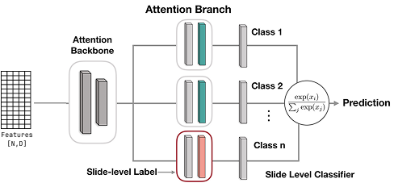
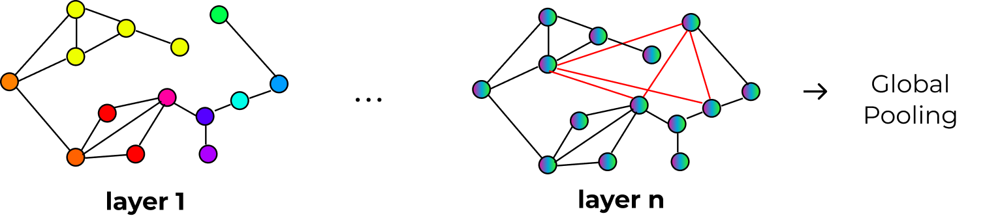

===================================
Model Architectures
===================================

.. contents:: Table of Contents
   :depth: 2
   :local:

This section describes available MIL models and when to use them.

Set-Based Models
================

Attention-Based MIL (ABMIL)
---------------------------
Ilse, M., Tomczak, J. M., & Welling, M. (2018). Attention-based Deep Multiple Instance Learning.

**Classification**

.. code-block:: python

   from cellmil.models.mil.attentiondeepmil import AttentionDeepMIL, LitAttentionDeepMIL
   from torch.optim import AdamW
   
   def lit_model_creator(input_dim: int):
       model = AttentionDeepMIL(
           embed_dim=input_dim,
           size_arg=[256, 128],
           n_classes=2,
           attention_branches=8,
           temperature=1.5,
       )
       
       lit_model = LitAttentionDeepMIL(
           model=model,
           optimizer=AdamW(model.parameters(), lr=1e-4),
       )
       return lit_model

**Survival (SurvAttentionDeepMIL)**

.. code-block:: python

   from cellmil.models.mil.attentiondeepmil import AttentionDeepMIL, LitSurvAttentionDeepMIL
   from cellmil.datamodels.transforms import TimeDiscretizerTransform
   from torch.optim import AdamW
   
   label = ("OS_MONTHS", "OS_EVENT")
   label_transforms = TimeDiscretizerTransform(n_bins=4)
   
   def lit_model_creator(input_dim: int):
       model = AttentionDeepMIL(
           embed_dim=input_dim,
           size_arg=[256, 128],
           n_classes=4,  # n_bins
           attention_branches=8,
       )
       
       lit_model = LitSurvAttentionDeepMIL(
           model=model,
           optimizer=AdamW(model.parameters(), lr=1e-4),
       )
       return lit_model

CLAM
----
Data-efficient and weakly supervised computational pathology on whole-slide images. Lu, Ming Y et al., Nature Biomedical Engineering, 2021. DOI: https://doi.org/10.1038/s41551-021-00707-9

**Classification**

.. code-block:: python

   from cellmil.models.mil.clam import CLAM_SB, LitCLAM
   from torch.optim import AdamW
   
   def lit_model_creator(input_dim: int):
        model = CLAM_SB(
            embed_dim=input_dim,
            size_arg="small", 
            n_classes=2,
            k_sample=8
        )
        
        lit_model = LitCLAM(
            model=model,
            optimizer=AdamW(model.parameters(), lr=1e-4),
        )
        return lit_model

**Survival (SurvCLAM)**

.. code-block:: python

   from cellmil.models.mil.clam import CLAM_SB, LitSurvCLAM
   from cellmil.datamodels.transforms import TimeDiscretizerTransform
   from torch.optim import AdamW
   
   label = ("OS_MONTHS", "OS_EVENT")
   label_transforms = TimeDiscretizerTransform(n_bins=4)
   
   def lit_model_creator(input_dim: int):
       model = CLAM_SB(
           embed_dim=input_dim,
           size_arg="small",
           n_classes=4,  # n_bins
           k_sample=8,
       )
       
       lit_model = LitSurvCLAM(
           model=model,
           optimizer=AdamW(model.parameters(), lr=1e-4),
       )
       return lit_model

Head4Type
---------

Uses separate attention heads for each cell type (neoplastic, inflammatory, connective, etc.). Each cell type gets its own attention mechanism.

.. warning::
   **Requirements:** This model requires cell type information from the segmentation model. Use **CellViT** or **HoVerNet** for segmentation. **Cellpose+SAM does not provide cell types** and cannot be used with this model.

.. note::
   Don't use with deep learning features (ResNet50, GigaPath, UNI) as they don't preserve cell-level type information.

**Classification**

.. code-block:: python

   from cellmil.models.mil.head4type import Head4Type, LitHead4Type
   from torch.optim import AdamW
   
   def lit_model_creator(input_dim: int):
       model = Head4Type(
           embed_dim=input_dim,
           size_arg=[256, 128],
           n_classes=2,
           cell_types=5,
           temperature=1.5,
       )
       
       lit_model = LitHead4Type(
           model=model,
           optimizer=AdamW(model.parameters(), lr=1e-4),
       )
       return lit_model

**Survival (SurvHead4Type)**

.. code-block:: python

   from cellmil.models.mil.head4type import Head4Type, LitSurvHead4Type
   from cellmil.datamodels.transforms import TimeDiscretizerTransform
   from torch.optim import AdamW
   
   label = ("OS_MONTHS", "OS_EVENT")
   label_transforms = TimeDiscretizerTransform(n_bins=4)
   
   def lit_model_creator(input_dim: int):
       model = Head4Type(
           embed_dim=input_dim,
           size_arg=[256, 128],
           n_classes=4,  # n_bins
           cell_types=5,
           temperature=1.5,
       )
       
       lit_model = LitSurvHead4Type(
           model=model,
           optimizer=AdamW(model.parameters(), lr=1e-4),
       )
       return lit_model

CellConv
--------

Applies 1D convolutions over the cell sequence before attention pooling. Tries to capture local patterns in spatially-ordered cell features.

It is experimental scenarios only. This model was only used for technical validation while developing CellMIL.

**Classification**

.. code-block:: python

   from cellmil.models.mil.cellconv import CellConv, LitCellConv
   from torch.optim import AdamW
   
   def lit_model_creator(input_dim: int):
       model = CellConv(
            embed_dim=input_dim,
            n_classes=2,
            convolution_depth=3,
            size_arg=[512, 128],
            attention_branches=1,
            temperature=1.0,
            dropout=0.0,
            kernel_size=3,
       )
       
       lit_model = LitCellConv(
           model=model,
           optimizer=AdamW(model.parameters(), lr=1e-4),
       )
       return lit_model

**Survival (SurvCellConv)**

.. code-block:: python

   from cellmil.models.mil.cellconv import CellConv, LitSurvCellConv
   from cellmil.datamodels.transforms import TimeDiscretizerTransform
   from torch.optim import AdamW
   
   label = ("OS_MONTHS", "OS_EVENT")
   label_transforms = TimeDiscretizerTransform(n_bins=4)
   
   def lit_model_creator(input_dim: int):
       model = CellConv(
           embed_dim=input_dim,
           n_classes=4,  # n_bins
           convolution_depth=3,
           size_arg=[512, 128],
           attention_branches=1,
       )
       
       lit_model = LitSurvCellConv(
           model=model,
           optimizer=AdamW(model.parameters(), lr=1e-4),
       )
       return lit_model

Multifocus
----------

Uses multi-head attention where each head focuses on different feature dimensions. Aggregates using diagonal elements of the attention-feature product matrix.

It is experimental scenarios only. This model uses a unique diagonal aggregation approach that hasn't been extensively validated.

.. code-block:: python

   from cellmil.models.mil.multifocus import MultiFocus, LitMultiFocus
   from torch.optim import AdamW
   
   def lit_model_creator(input_dim: int):
       model = MultiFocus(
           embed_dim=input_dim,
           n_classes=2,
           size_arg=[32],
           temperature=1.0,
           dropout=0.0,
       )
       
       lit_model = LitMultiFocus(
           model=model,
           optimizer=AdamW(model.parameters(), lr=1e-4),
       )
       return lit_model

Standard MIL
------------
Data-efficient and weakly supervised computational pathology on whole-slide images. Lu, Ming Y et al., Nature Biomedical Engineering, 2021. DOI: https://doi.org/10.1038/s41551-021-00707-9

**Classification**

.. code-block:: python

   from cellmil.models.mil.standard import MIL_fc, MIL_fc_mc, LitStandard
   from torch.optim import AdamW
   
   def lit_model_creator(input_dim: int):
       # Binary classification
       model = MIL_fc(
           embed_dim=input_dim,
           size_arg="small",  # or list like [256]
           n_classes=2,
           top_k=1,  # Number of top instances to select
           dropout=0.25,
       )
       
       # For multi-class (n_classes > 2), use MIL_fc_mc instead:
       # model = MIL_fc_mc(embed_dim=input_dim, n_classes=3, top_k=1)
       
       lit_model = LitStandard(
           model=model,
           optimizer=AdamW(model.parameters(), lr=1e-4),
       )
       return lit_model

HistoBistro
-----------
Transformer-based biomarker prediction from colorectal cancer histology: A large-scale multicentric study. Wagner, Sophia J et al., Cancer Cell, Elsevier. DOI: https://doi.org/10.1016/j.ccell.2023.02.002

TransMIL
--------
Transmil: Transformer based correlated multiple instance learning for whole slide image classification. Shao, Zhuchen et al., Advances in Neural Information Processing Systems, 2021. DOI: https://proceedings.neurips.cc/paper/2021/hash/10c272d06794d3e5785d5e7c5356e9ff-Abstract.html

Graph-Based Models
==================

These models build a graph connecting nearby cells and use graph neural networks to let cells exchange information with their neighbors.

**General setup:**

.. code-block:: python

   from cellmil.datamodels.datasets import GNNMILDataset
   
   # Use GNNMILDataset instead of MILDataset
   dataset = GNNMILDataset(
       root=config.root,
       label=config.label,
       folder=config.folder,
       data=df,
       extractor=config.extractor,
       segmentation_model=config.segmentation_model,
       graph_creator="delaunay_radius",  # Required!
   )

Graph Attention Networks (GAT)
------------------------------
Veličković, P., Cucurull, G., Casanova, A., Romero, A., Lio, P., & Bengio, Y. (2017). Graph attention networks. arXiv preprint arXiv:1710.10903.

**Classification**

.. code-block:: python

   from cellmil.models.mil.graphmil import GAT, Attention, LitGraphMIL
   from cellmil.datamodels.datasets import GNNMILDataset
   from cellmil.utils.train.evals import KFoldCrossValidation
   from torch.optim import AdamW
   
   # Use GNNMILDataset for graph-based models
   dataset = GNNMILDataset(
       root=config.root,
       label=config.label,
       folder=config.folder,
       data=df,
       extractor=config.extractor,
       segmentation_model=config.segmentation_model,
       graph_creator="delaunay_radius",
   )
   
   def lit_model_creator(input_dim: int):
       # GNN backbone
       gnn = GAT(
           input_dim=input_dim,
           hidden_dim=256,
           n_layers=4,
           dropout=0.25,
           heads=3,
       )
       
       # Attention pooling head
       pooling = Attention(
           input_dim=gnn.hidden_dim,
           size_arg=[256, 128],
           n_classes=2,
           attention_branches=8,
           temperature=1.5,
       )
       
       lit_model = LitGraphMIL(
           gnn=gnn,
           pooling_classifier=pooling,
           optimizer_cls=AdamW,
           optimizer_kwargs={"lr": 1e-4},
       )
       return lit_model
   
   # Run k-fold cross-validation
   k_fold = KFoldCrossValidation(k=5)
   model_storage = k_fold.evaluate(
       name="gat_experiment",
       lit_model_creator=lit_model_creator,
       dataset=dataset,
       output_dir=Path("./results"),
       wandb_project="my_project",
   )

**Survival (SurvGraphMIL)**

.. code-block:: python

   from cellmil.models.mil.graphmil import GAT, Attention, LitSurvGraphMIL
   from cellmil.datamodels.datasets import GNNMILDataset
   from cellmil.datamodels.transforms import TimeDiscretizerTransform
   from torch.optim import AdamW
   
   label = ("OS_MONTHS", "OS_EVENT")
   label_transforms = TimeDiscretizerTransform(n_bins=4)
   
   dataset = GNNMILDataset(
       label=label,
       graph_creator="delaunay_radius",
       # ... other parameters
   )
   
   def lit_model_creator(input_dim: int):
       gnn = GAT(
           input_dim=input_dim,
           hidden_dim=256,
           n_layers=4,
           dropout=0.25,
           heads=3,
       )
       
       pooling = Attention(
           input_dim=gnn.hidden_dim,
           size_arg=[256, 128],
           n_classes=4,  # n_bins
           attention_branches=8,
       )
       
       lit_model = LitSurvGraphMIL(
           gnn=gnn,
           pooling_classifier=pooling,
           optimizer_cls=AdamW,
           optimizer_kwargs={"lr": 1e-4},
       )
       return lit_model

Other GNN Backbones
-------------------

You can swap GAT with other GNN architectures. All work with both classification (LitGraphMIL) and survival (LitSurvGraphMIL).

**GraphSAGE:**
Hamilton, W., Ying, Z., & Leskovec, J. (2017). Inductive representation learning on large graphs. Advances in neural information processing systems, 30.

.. code-block:: python

   from cellmil.models.mil.graphmil import SAGE
   
   gnn = SAGE(
       input_dim=input_dim,
       hidden_dim=256,
       n_layers=3,
       dropout=0.25,
   )

**EGNN (Equivariant GNN):**
Satorras, V. G., Hoogeboom, E., & Welling, M. (2021, July). E (n) equivariant graph neural networks. In International conference on machine learning (pp. 9323-9332). PMLR.

.. code-block:: python

   from cellmil.models.mil.graphmil import EGNN
   
   gnn = EGNN(
       input_dim=input_dim,
       hidden_dim=256,
       n_layers=3,
   )

**SGFormer:**
Wu, Q., Zhao, W., Yang, C., Zhang, H., Nie, F., Jiang, H., ... & Yan, J. (2023). Sgformer: Simplifying and empowering transformers for large-graph representations. Advances in Neural Information Processing Systems, 36, 64753-64773.

.. code-block:: python

   from cellmil.models.mil.graphmil import SGFormer
   
   gnn = SGFormer(
       input_dim=input_dim,
       hidden_dim=256,
       n_layers=3,
   )

**SmallWorld:**

Dynamically creates shortcuts between important cells. Experimental.

.. code-block:: python

   from cellmil.models.mil.graphmil import SmallWorld
   
   gnn = SmallWorld(
       input_dim=input_dim,
       hidden_dim=256,
       gamma=0.5,
   )

Dynamically creates shortcuts between important cells. Experimental.

Pooling Methods
---------------

After the GNN processes the graph, you need to pool node embeddings into a slide-level representation:

**Attention Pooling (Recommended):**

.. code-block:: python

   from cellmil.models.mil.graphmil import Attention
   
   pooling = Attention(
       input_dim=gnn.hidden_dim,
       size_arg=[256, 128],
       n_classes=2,
       attention_branches=8,
   )

**Mean Pooling:**

Simple averaging. Use as baseline.

**CLAM Pooling:**

.. code-block:: python

   from cellmil.models.mil.graphmil import CLAM
   
   pooling = CLAM(
       input_dim=gnn.hidden_dim,
       size_arg=[256, 128],
       n_classes=2,
   )

Next Steps
==========

- :doc:`training` - Train your chosen model
- :doc:`configuration` - Configure feature extractors
