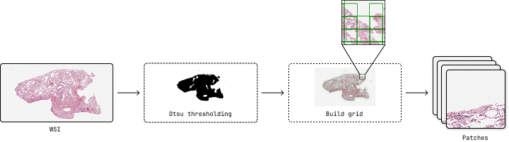

================
Patch Extraction
================

The patch extraction tool is the first step in the pipeline. It extracts patches from whole slide images (WSI) with configurable parameters for downstream analysis.

Overview
========

Patch extraction divides large whole slide images into smaller, manageable patches that can be processed by cell segmentation models. This step is crucial for handling the massive size of WSI files while maintaining spatial information.

CLI Usage
=========

Basic Command
-------------

.. code-block:: bash

   poetry run patch_extraction [OPTIONS]

Required Arguments
------------------

.. option:: --output_path PATH

   Directory where extracted patches and metadata will be saved. The tool will create subdirectories for organizing the output.

.. option:: --wsi_path PATH

   Path to the whole slide image file. Supports formats compatible with OpenSlide (SVS, TIFF, NDPI, etc.).

.. option:: --patch_size INTEGER

   Size of patches to extract in pixels. Common values are 256, 512, 1024, or 2048.

.. option:: --patch_overlap FLOAT

   Overlap percentage between adjacent patches (0.0-100.0). Higher values provide better coverage but increase processing time.

.. option:: --target_mag FLOAT

   Target magnification for patch extraction.

Complete Example
----------------

.. code-block:: bash

   poetry run patch_extraction \
       --output_path ./results \
       --wsi_path ./data/C3L-00001-21.svs \
       --patch_size 1024 \
       --patch_overlap 6.25 \
       --target_mag 20.0

This command will:

1. Load the WSI file ``C3L-00001-21.svs``
2. Resample to 20x magnification
3. Extract 1024x1024 pixel patches with 6.25% overlap
4. Save results to ``./results/C3L-00001-21/``

Python API Usage
================

You can also use patch extraction programmatically in Python:

.. code-block:: python

   from cellmil.data import PatchExtractor
   from cellmil.interfaces import PatchExtractorConfig
   from pathlib import Path

   # Create configuration
   config = PatchExtractorConfig(
       output_path=Path("./results"),
       wsi_path=Path("./data/C3L-00001-21.svs"),
       patch_size=1024,
       patch_overlap=6.25,
       target_mag=20.0
   )

   # Initialize extractor
   extractor = PatchExtractor(config)
   
   # Extract patches
   extractor.get_patches()

Configuration Parameters
========================

Patch Size Selection
-------------------

The patch size determines the field of view for each extracted region:

- **256px**: Faster processing, lower memory usage, may miss larger cellular structures
- **1024px**: Captures more context, requires more memory and processing time

Overlap Considerations
---------------------

Overlap between patches helps ensure complete coverage:

- **0%**: No overlap, fastest processing, risk of missing edge cells
- **6.25%**: Standard overlap, good balance of coverage and efficiency
- **25%**: High overlap, thorough coverage, significantly more patches

Magnification Guidelines
-----------------------

Target magnification affects the level of detail captured:

- **20x**: Good balance of detail and coverage.
- **40x**: High detail, individual cell features clearly visible

Output Structure
===============

The patch extraction creates the following directory structure:

.. code-block:: text

   output_path/
   └── {slide_name}/
       ├── patches/
       │   ├── patch_0_0.png
       │   ├── patch_0_1.png
       │   ├── patch_1_0.png
       │   └── ...
       ├── ...
       └── thumbnail.png       # Slide thumbnail with patch overlay

File Descriptions
----------------

- **patches/**: Directory containing individual patch images in PNG format
- **thumbnail.png**: Overview image showing patch locations
- Other files are generated for metadata and future processing steps.

Performance Considerations
=========================

Memory Usage
-----------

Memory requirements depend on:

- Patch size: Larger patches require more RAM
- Number of patches: Determined by slide size and overlap
- WSI file size: Larger slides require more memory for loading

Processing Time
--------------

Factors affecting processing time:

- WSI file size
- Target magnification
- Patch overlap percentage
- Storage I/O speed

Troubleshooting
==============

Error Messages
-------------

.. code-block:: text

   Error: Unable to open slide file
   
**Solution**: Check file path and format compatibility

.. code-block:: text

   Error: Insufficient disk space
   
**Solution**: Free up disk space or choose different output location

.. code-block:: text

   Error: Invalid magnification
   
**Solution**: Check available magnifications in the WSI file

Integration with Pipeline
========================

Patch extraction is typically followed by:

1. **Cell Segmentation**: Process patches to identify individual cells
2. **Feature Extraction**: Extract features from segmented cells
3. **MIL Analysis**: Aggregate patch-level features for slide-level predictions

The output directory structure is designed to be compatible with subsequent pipeline steps.

See Also
========

- :doc:`cell_segmentation` - Next step in the pipeline
- :doc:`../api/_autosummary/cellmil.data` - API documentation for data handling
- :doc:`../quickstart` - Quick start guide for the complete pipeline
